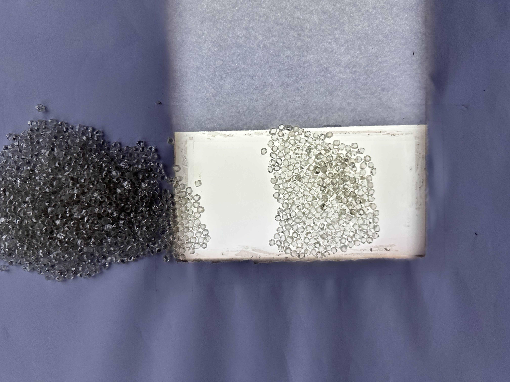

  

<em>Small, flawed, and becoming.</em>

---

### Veronica Baker
North Carolina → Florida → Colorado → Connecticut → Colorado → California → repeat → travel → 

France (Paris <3) → New York (Now). Fashion and luxury → AI and machine learning.

I spent three years in Paris working across fashion, ecommerce, hospitality, and the art world. At places like,  MINT Group to the Drouot Art Foundation to L'Ecole Van Cleef & Arpels. Now I'm freelance in New York, building AI companies and working toward launching a venture fund.

This GitHub is early & rough, like the diamonds above + imperfect, and not finished yet. But everything here is real, and everything here can becoming something recognizable.

**Currently:**
- Building AI companies as an independent founder
- Shipping my first ML projects in public
- Writing weekly on (https://substack.com/@veron1cabak3r) about AI, venture, and what's next
- Working toward launching a VC fund focused on emerging AI

**Find me:** (https://substack.com/@veron1cabak3r) · [LinkedIn](https://www.linkedin.com/in/veronicabaker228/)
